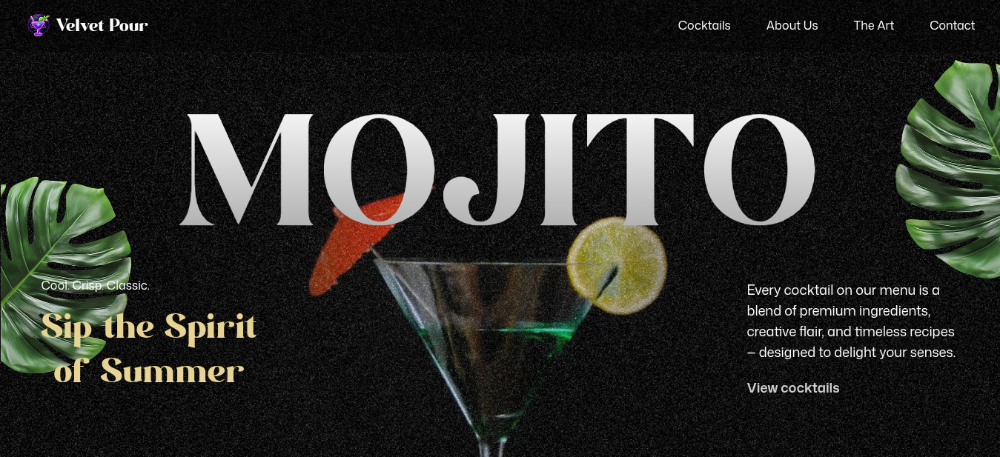

   
    
   

   

    
    
    
  

  <h3 align="center">GSAP-Powered Cocktail Website</h3>

## <a name="introduction">🤖 Introduction</a>
I built and deployed a stunning cocktail website using React and Tailwind CSS, focusing on a scroll-driven experience powered by GSAP. I incorporated dynamic SplitText reveals, smooth parallax scrolling, and scroll-triggered effects with ScrollTrigger. I also added pinned animations, scroll-synced video playback, scroll-based image masking, and a custom animated carousel. The site features seamless timeline animations across sections and is fully responsive across all screen sizes.

## <a name="features">🔋 Features</a>

👉 **SplitText Animations**: Create impactful text reveals using GSAP’s SplitText for dynamic intros and section highlights.

👉 **ScrollTrigger Effects**: Power scroll-based animations and timeline control with GSAP’s ScrollTrigger.

👉 **Parallax Scrolling**: Add immersive depth with smooth parallax effects that respond to user scroll.

👉 **Pinned Sections**: Lock sections in view while animating content for engaging scroll experiences.

👉 **Scroll-Synced Video Playback**: Sync video progress with scroll position for cinematic storytelling.

👉 **Image Masking Effects**: Use scroll-triggered pins and masks for visually striking image transitions.

👉 **Custom Carousel**: Build a fully customized carousel with multiple navigation options and animated slides.

👉 **Seamless Timeline Animations**: Craft smooth animation timelines that span across multiple sections.

👉 **Responsive Design**: Ensure fluid UI and adaptive GSAP animations across all screen sizes.
